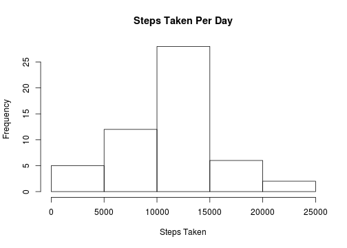
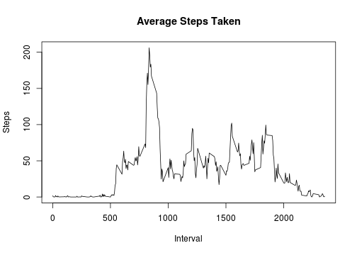
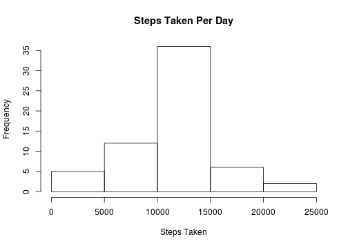
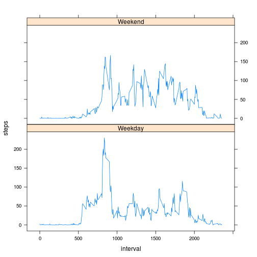

## Assumptions
  1. Repository has been cloned. 
  2. Activity data has been extracted.
  3. Your working directory has been set accordingly.
 
## Loading and preprocessing the data

```r
if (!file.exists("activity.csv")) {
  unzip("activity.zip")
}

activityData <- read.csv("activity.csv")
activityData$interval  <- as.numeric(activityData$interval)
```

## What is mean total number of steps taken per day?
#### Total number of steps per day

```r
stepsPerDay  <- aggregate(x=activityData[c("steps")], 
                          FUN=sum, 
                          by = list(day = activityData$date))
```

#### Histogram of steps per day

```r
hist(stepsPerDay$steps, freq=T,
     main="Steps Taken Per Day",
     xlab="Steps Taken", ylab="Frequency")
```

 

#### Mean and median of the total number of steps taken per day

```r
mean(stepsPerDay$steps, na.rm=T)
```

```
## [1] 10766.19
```

```r
median(stepsPerDay$steps, na.rm=T)
```

```
## [1] 10765
```


## What is the average daily activity pattern?
#### Interval vs.  average number of steps taken per day
##### Using dplyr for manipulating our data

```r
library("dplyr")
```


```r
avgStepsPerInterval <- aggregate(x=activityData[c("steps")],
                                 FUN=function(e) { mean(e, na.rm=T)},
                                 by = list(interval = activityData$interval))
avgStepsPerInterval  <- rename(avgStepsPerInterval, mean.steps = steps)

plot(avgStepsPerInterval, type="l",
     main="Average Steps Taken", xlab="Interval", ylab="Steps")
```

 

#### Interval with max number of steps

```r
avgStepsPerInterval[which.max(avgStepsPerInterval$mean.steps), ]$interval
```

```
## [1] 835
```

## Imputing missing values
Note that there are a number of days/intervals where there are missing values (coded as NA). The presence of missing days may introduce bias into some calculations or summaries of the data

#### Total number of missing values

```r
dim(activityData[is.na(activityData$steps) == TRUE, ])[1]
```

```
## [1] 2304
```

```r
dim(activityData[is.na(activityData$date) == TRUE, ])[1]
```

```
## [1] 0
```

```r
dim(activityData[is.na(activityData$interval) == TRUE, ])[1]
```

```
## [1] 0
```

#### Filling in missing values.
Will use the mean steps per interval to fill in missing steps (coded as NA). The following function encapsulates the logic to accomplish this.

```r
FillNaWithMeanOfInterval  <- function(x) {
  steps  <- x[1]
  interval  <- x[3]
  
  if(is.na(steps)) {
    avg  <- avgStepsPerInterval[as.numeric(avgStepsPerInterval$interval) == as.numeric(interval), ]
    avg$mean.steps
  } else {
    steps
  }  
}
```

#### New dataset with missing values of steps filled in with the mean steps for interval

```r
activityData2  <- activityData
activityData2$steps  <- apply(activityData2, 1, FUN=FillNaWithMeanOfInterval)
```


#### Verify we don't have any missing values for the steps variable

```r
dim(activityData2[is.na(activityData2$steps) == TRUE, ])[1]
```

```
## [1] 0
```

#### Histogram of steps per day without missing values for steps

```r
stepsPerDay2 <- aggregate(x=activityData2[c("steps")], 
                          FUN=function(s)sum(as.numeric(s)), 
                          by = list(day = activityData2$date))
hist(stepsPerDay2$steps, freq=T,
     main="Steps Taken Per Day",
     xlab="Steps Taken")
```

 

#### Mean and median of the total number of steps taken per day without missing values for steps

```r
mean(stepsPerDay2$steps)
```

```
## [1] 10766.19
```

```r
median(stepsPerDay2$steps)
```

```
## [1] 10766.19
```
The values for mean and median from the second dataset, are not so much different from the original dataset which had missing values.
I suspect that the strategy used to fill in missing values was not effective for the shape of our original data set. The impact was negligible.

## Are there differences in activity patterns between weekdays and weekends?
#### Add a new factor variable to denote if date is weekday or weekend. Variable will be named ''sow'' for segment of week.

```r
activityData2$sow <- ifelse(weekdays.Date(as.Date(activityData2$date)) 
                            %in% c("Saturday", "Sunday"),
                            "Weekend", "Weekday")
head(activityData2)                 
```

```
##                steps       date interval     sow
## 1   1.71698113207547 2012-10-01        0 Weekday
## 2  0.339622641509434 2012-10-01        5 Weekday
## 3  0.132075471698113 2012-10-01       10 Weekday
## 4  0.150943396226415 2012-10-01       15 Weekday
## 5 0.0754716981132075 2012-10-01       20 Weekday
## 6   2.09433962264151 2012-10-01       25 Weekday
```

#### Time series plot (i.e. type = "l") of the 5-minute interval vs. the average number of steps taken, averaged across all weekday days or weekend days.
Load lattice graphing library

```r
library("lattice")
```


```r
d3  <- aggregate(steps ~ interval+sow, 
                 data=activityData2, 
                 FUN=function(e) mean(as.numeric(e)))

xyplot(steps ~ interval | sow, data = d3, type="l", layout=c(1,2))
```

 

Based on this graph, it seems that there are some differences between weekdays and weekends.
